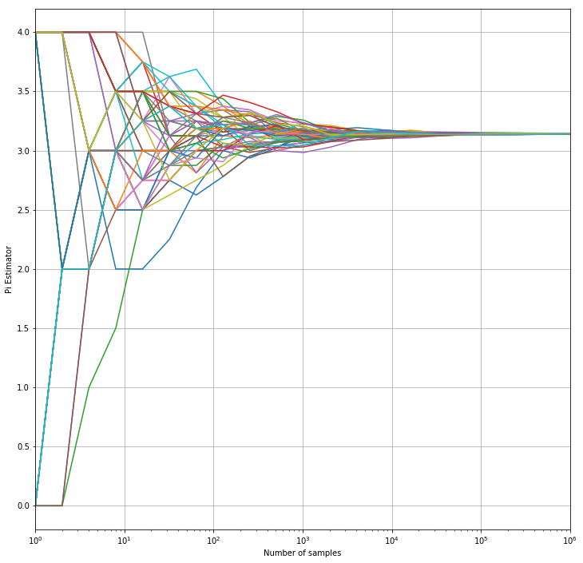

```python
import random
from math import pi
import numpy as np
import matplotlib.pyplot as plt
```


```python
def if_in_circle(x, y):
    return int(x**2 + y**2 <= 1)
```


```python
def get_a_sample():
    x = random.random()
    y = random.random()
    return x, y
```


```python
def update(count, count_in_circle):
    x, y = get_a_sample()
    count_in_circle += if_in_circle(x, y)
    count += 1
    return(count, count_in_circle)
```


```python
def error_cal(estimate):
    return abs(estimate - pi / 4)
```


```python
errors = np.array([0.0] * 100)
N = 1000000
num_exp = 50

for _ in range(num_exp):
    count = count_in_circle = error_index = 0
    for index in range(1, N + 1):
        count, count_in_circle = update(count, count_in_circle)
        pi_estimate = count_in_circle / count
        if index & (index - 1) == 0:
            errors[error_index] += error_cal(pi_estimate)
            error_index += 1
            
errors = errors / float(num_exp)
```


```python
plt.loglog(np.logspace(start = 0, stop = 99, num = 100, base = 2), errors, 'o')
plt.grid(True)
plt.xlabel('Number of samples')
plt.ylabel('Empirical mean of error')
plt.xlim((0, 1e6))
plt.show()
```





The result is consistent with Central Limit Theorem, namely $error \sim \sqrt{N}$
