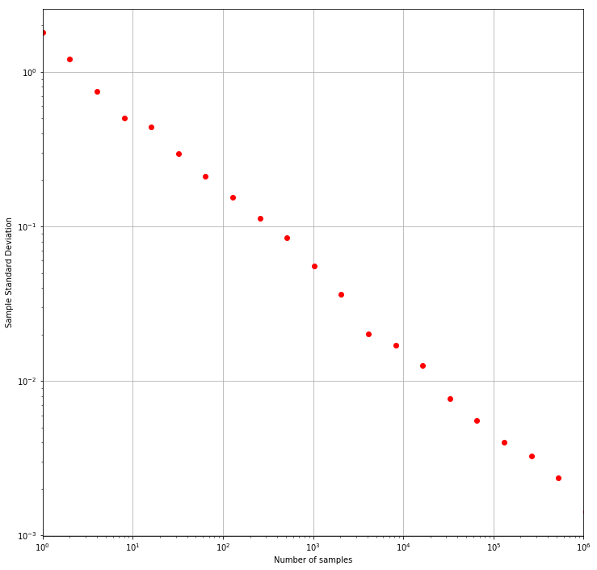
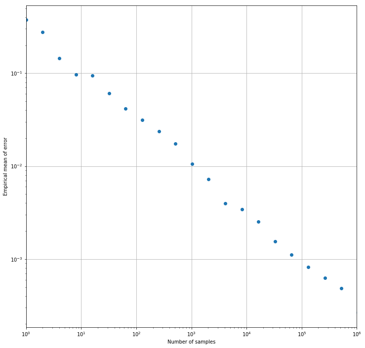

```python
import random
from math import pi
import numpy as np
import pandas as pd
import matplotlib.pyplot as plt
import pylab
```


```python
def if_in_circle(x, y):
    return int(x**2 + y**2 <= 1)
```


```python
def get_a_sample():
    x = random.random()
    y = random.random()
    return x, y
```


```python
def update(count, count_in_circle):
    x, y = get_a_sample()
    count_in_circle += if_in_circle(x, y)
    count += 1
    return(count, count_in_circle)
```


```python
def error_cal(estimate):
    return abs(estimate - pi / 4)
```


```python
pylab.rcParams['figure.figsize'] = (12.0, 12.0)
```


```python
errors = np.zeros(100)
N = 2 ** 20
num_exp = 50
pi_exp = np.zeros((num_exp, 100))


for exp_index in range(num_exp):
    count = count_in_circle = error_index = 0
    for index in range(1, N + 1):
        count, count_in_circle = update(count, count_in_circle)
        pi_estimate = count_in_circle / count
        if index & (index - 1) == 0:
            current_error = error_cal(pi_estimate)
            errors[error_index] += current_error
            pi_exp[exp_index, error_index] = pi_estimate * 4
            error_index += 1
    plt.plot(np.logspace(start = 0, stop = 99, num = 100, base = 2), pi_exp[exp_index], '-')

plt.grid(True)
plt.xlabel('Number of samples')
plt.ylabel('Pi Estimator')
plt.xscale('log')
plt.xlim((0, 1e6))
plt.show()    
```


```python
stds = np.std(pi_exp, axis = 0)
plt.loglog(np.logspace(start = 0, stop = 99, num = 100, base = 2), stds, 'or')
plt.grid(True)
plt.xlabel('Number of samples')
plt.ylabel('Sample Standard Deviation')
plt.xscale('log')
plt.xlim((0, 1e6))
plt.show()    
```





```python
pd.DataFrame(list(zip(np.logspace(start = 0, stop = 99, num = 100, base = 2), stds))[:21], columns=['# of Sam'])
```


<div>
<style>
    .dataframe thead tr:only-child th {
        text-align: right;
    }

    .dataframe thead th {
        text-align: left;
    }

    .dataframe tbody tr th {
        vertical-align: top;
    }
</style>
<table border="1" class="dataframe">
  <thead>
    <tr style="text-align: right;">
      <th></th>
      <th>0</th>
      <th>1</th>
    </tr>
  </thead>
  <tbody>
    <tr>
      <th>0</th>
      <td>1.0</td>
      <td>1.795996</td>
    </tr>
    <tr>
      <th>1</th>
      <td>2.0</td>
      <td>1.215895</td>
    </tr>
    <tr>
      <th>2</th>
      <td>4.0</td>
      <td>0.744043</td>
    </tr>
    <tr>
      <th>3</th>
      <td>8.0</td>
      <td>0.500400</td>
    </tr>
    <tr>
      <th>4</th>
      <td>16.0</td>
      <td>0.442182</td>
    </tr>
    <tr>
      <th>5</th>
      <td>32.0</td>
      <td>0.295762</td>
    </tr>
    <tr>
      <th>6</th>
      <td>64.0</td>
      <td>0.211797</td>
    </tr>
    <tr>
      <th>7</th>
      <td>128.0</td>
      <td>0.154445</td>
    </tr>
    <tr>
      <th>8</th>
      <td>256.0</td>
      <td>0.113441</td>
    </tr>
    <tr>
      <th>9</th>
      <td>512.0</td>
      <td>0.084079</td>
    </tr>
    <tr>
      <th>10</th>
      <td>1024.0</td>
      <td>0.055487</td>
    </tr>
    <tr>
      <th>11</th>
      <td>2048.0</td>
      <td>0.036385</td>
    </tr>
    <tr>
      <th>12</th>
      <td>4096.0</td>
      <td>0.020150</td>
    </tr>
    <tr>
      <th>13</th>
      <td>8192.0</td>
      <td>0.017009</td>
    </tr>
    <tr>
      <th>14</th>
      <td>16384.0</td>
      <td>0.012622</td>
    </tr>
    <tr>
      <th>15</th>
      <td>32768.0</td>
      <td>0.007717</td>
    </tr>
    <tr>
      <th>16</th>
      <td>65536.0</td>
      <td>0.005581</td>
    </tr>
    <tr>
      <th>17</th>
      <td>131072.0</td>
      <td>0.004006</td>
    </tr>
    <tr>
      <th>18</th>
      <td>262144.0</td>
      <td>0.003261</td>
    </tr>
    <tr>
      <th>19</th>
      <td>524288.0</td>
      <td>0.002368</td>
    </tr>
    <tr>
      <th>20</th>
      <td>1048576.0</td>
      <td>0.001418</td>
    </tr>
  </tbody>
</table>
</div>


```python
errors = errors / float(num_exp)
plt.loglog(np.logspace(start = 0, stop = 99, num = 100, base = 2), errors, 'o')
plt.grid(True)
plt.xlabel('Number of samples')
plt.ylabel('Empirical mean of error')
plt.xlim((0, 1e6))
plt.show()
```





The result is consistent with Central Limit Theorem, namely $error \sim \sqrt{N}$
